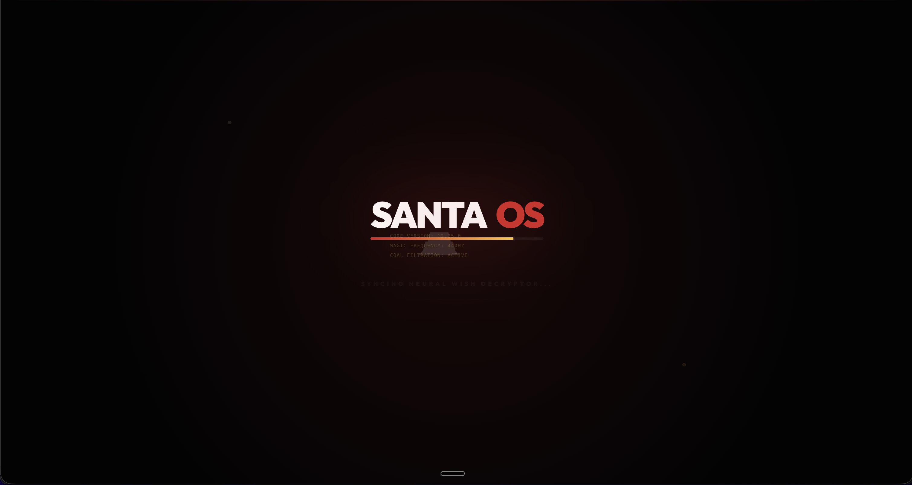
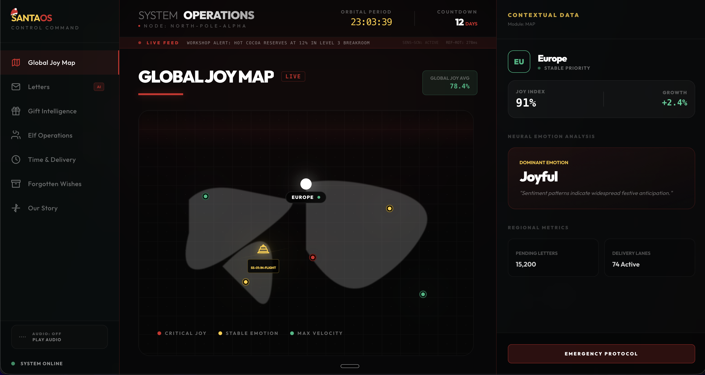
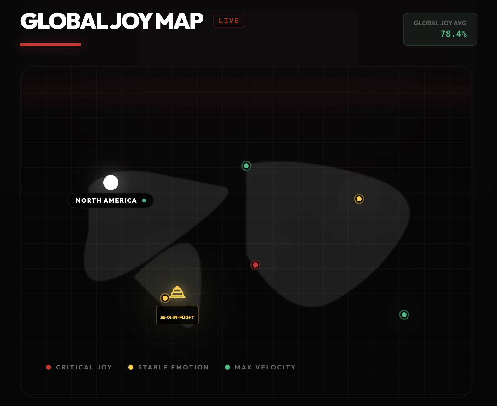
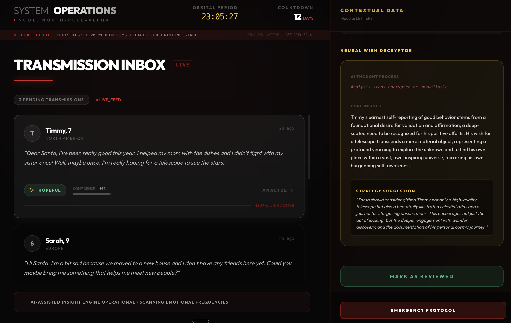

# 🎅 SantaOS: The Operational Heart of Christmas

### "The world has grown complex. Every year, more children, more wishes, and deeper, unspoken dreams. The clipboard and the ink pen... they weren't enough anymore. I needed to see more than just names on a list. I needed to see the heart of the world." — Santa



---

## 📖 Project Description

**SantaOS** was born out of a simple necessity: to ensure that the magic of Christmas remains as accurate as it is abundant. It is the first **Cinematic Command-Center** designed to give Santa Claus a global, emotion-aware perspective on human happiness.

For centuries, the North Pole operated on magic and hard work. But as the world entered the digital age, the "Global Joy Index" started to fluctuate. Traditional methods were missing the subtle signals—the lonely child in a new city, the anxious student worried about the reindeer, the quiet hope of someone who stopped asking.

SantaOS combines **tactical global monitoring** with **deep neural analysis** of letters (via Google Gemini AI), all while managing the complex logistics of the Elf Workshop. It is where **Data meets Magic.**

---

## ✨ Key Features

### 🌍 Global Joy Map

A real-time tactical overview of the world's emotional state. Regions glow based on their collective "Joy Index."

- **Tactical Scanning:** Identifies regions where festive spirit is high and where it needs an extra sprinkle of magic.
- **Regional Deep-Dive:** One click reveals the dominant emotion and priority levels for any continent.

### 📬 Neural Wish Decryptor (Gemini AI)

Gone are the days of just reading text. Our engine analyzes the "ink between the lines."

- **Sentiment Detection:** Automatically identifies if a child is _Lonely_, _Excited_, _Hopeful_, or _Anxious_.
- **AI-Powered Insights:** Uses **Google Gemini API** to analyze emotional subtext, providing a "Core Insight" for every letter.
- **Real-Time Transcript:** Watch the AI "think" in real-time as it decrypts the true heart of the wish.
- **Human-in-the-Loop:** Tools for Santa to review and authorize gift recommendations personally.

### 🎁 Gift Intelligence & Elf Operations

- **Real-Time Stock Monitoring:** Live inventory tracking of all toy categories.
- **Vitality Monitoring:** Real-time energy and mood tracking for every Elf technician.
- **Heuristic Alerts:** Automatic notifications when demand exceeds current workshop output.

### 🎵 Cinematic Experience

- **Immersive Soundscape:** Built-in North Pole ambient audio.
- **Interactive Controls:** Control the soundscape directly from the sidebar.
- **Dynamic UI:** Glassmorphism and smooth animations powered by `framer-motion`.

---

## 🛠️ Tech Stack Used

This project was built using the following technologies:

| Category           | Technology                                      |
| :----------------- | :---------------------------------------------- |
| **Framework**      | [Next.js 16 (App Router)](https://nextjs.org/)  |
| **Language**       | [TypeScript](https://www.typescriptlang.org/)   |
| **Styling**        | [Tailwind CSS](https://tailwindcss.com/)        |
| **Animations**     | [Framer Motion](https://www.framer.com/motion/) |
| **AI Integration** | [Google Gemini API](https://ai.google.dev/)     |
| **Icons**          | [Lucide React](https://lucide.dev/)             |
| **Deployment**     | Vercel                                          |

---

## 📸 Screenshots of the Application

Here is a glimpse into the SantaOS interface:

### The Command Dashboard


_The central hub for all North Pole operations._

### Global Joy Map


_Real-time visualization of global sentiment._

### Neural Wish Decryptor


_AI analysis of incoming letters._

_(Note: Screenshots are placeholders. Please add images to `public/screenshots` folder)_

---

## 🚀 Setup Instructions

Follow these steps to initialize the North Pole Node on your local machine.

### Prerequisites

- Node.js 18.0.0 or later
- A Google Gemini API Key

### Installation

1.  **Clone the Repository**

    ```bash
    git clone https://github.com/your-username/santa-os.git
    cd santa-os
    ```

2.  **Install Dependencies**

    ```bash
    npm install
    ```

3.  **Configure Environment**
    Create a `.env.local` file in the root directory and add your key:

    ```bash
    GEMINI_API_KEY=your_gemini_api_key_here
    ```

4.  **Launch the Command Center**

    ```bash
    npm run dev
    ```

5.  **Operational Access**
    Navigate to `http://localhost:3000` in your secure browser.

---

live link : https://santa-os.vercel.app/


## 🤝 Contributing

Elves (and humans) are welcome to contribute! Please read our [Contributing Guidelines](CONTRIBUTING.md) (if available) or simply open an issue if you spot a bug in the matrix.

---

**Built with ❤️ (and ☕) for the Christmas Hackathon.**
**Next.js 16 | React 19 | Google Gemini API | Tailwind CSS | Magic**
